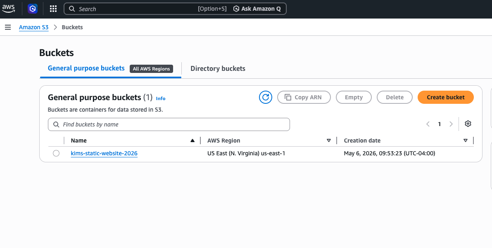
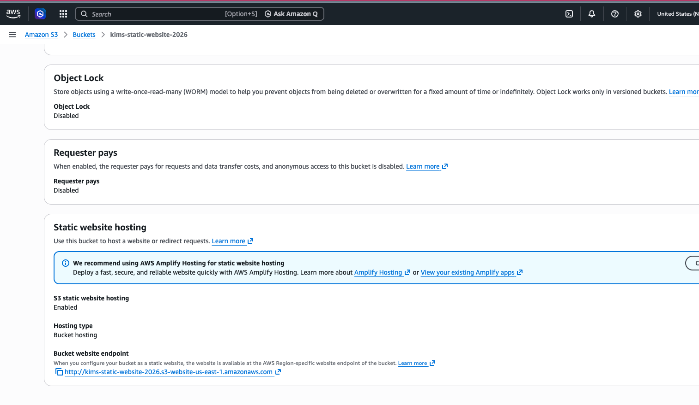
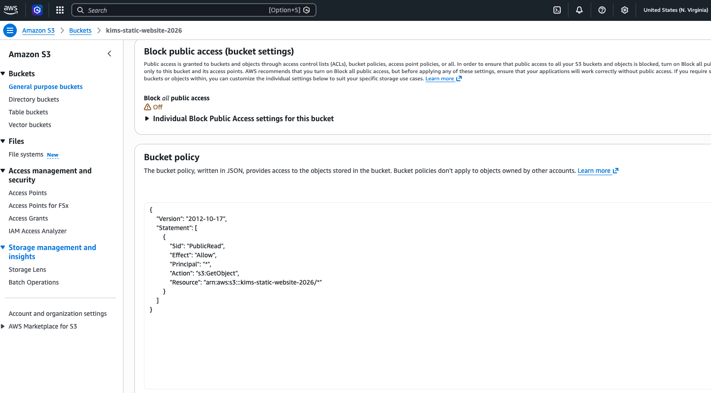

# AWS Static Website Project

## Overview
This project demonstrates how to deploy a static website using AWS S3 while applying basic security best practices.

## What I Did
- Created and configured an S3 bucket
- Enabled static website hosting
- Uploaded website files (HTML)
- Configured bucket permissions using a bucket policy
- Applied basic access control principles

## Skills Demonstrated
- AWS S3
- IAM (basic concepts)
- Cloud security fundamentals
- Troubleshooting

## Screenshots
## Screenshots

## Live Website
https://kims-static-website-2026.s3.us-east-1.amazonaws.com/StaticWebsite/index.html

## Key Takeaways
This project helped me understand how cloud storage, permissions, and web hosting work together in AWS.
